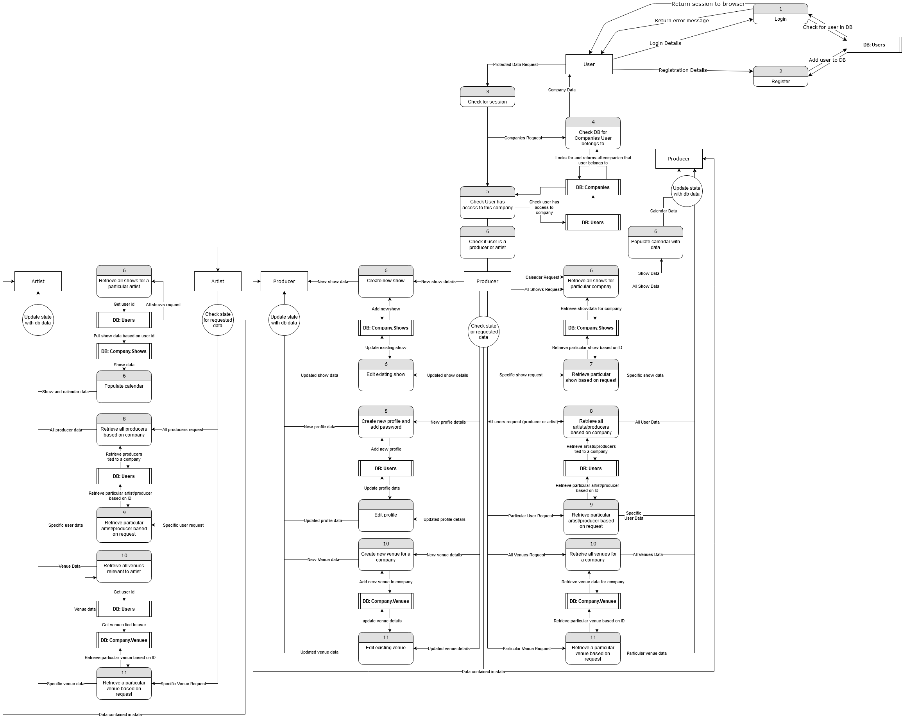
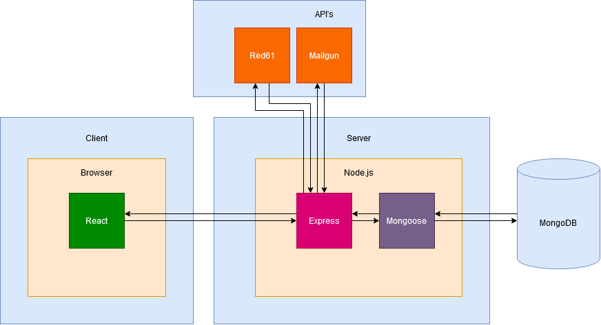
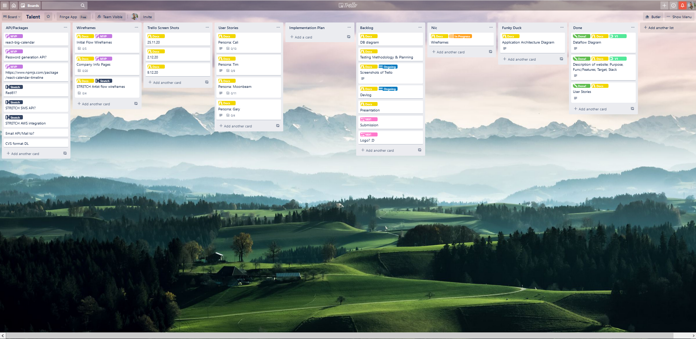

# Talent

Logo thingy maybe

## Description

__Purpose__
Talent is a event management platform designed for the easy collation and synthesis of show, venue, producer, ticket and performing artist information. It aims to bring all these sources of information together into an intuitive and easy to navigate interface. The goal of Talent is to simplify and standardize the sharing and flow of information between all producers and performing artists, ensuring the most relevant data is displayed in easy to navigate ways.

__Features__

-  Producers can sign up to the platform.

-  New producers can create a "company" database entry for a particular event/organisation/period of time.
-  Producers can create and add, or add existing producers to a company.
-  Producers can create and add, or add existing artists to a company.
-  If a producer or artist profile is newly created, a login is generated for the new profile.
-  Producers can create/edit venue profiles.
-  Producers can create/edit shows using existing artists and venues belonging to the company.
-  Created shows will be displayed in a calendar format on the company landing page.
-  Producers can look at lists of Artists, Venues and Shows.
-  Shows are listed by their upcoming date and separated into past and future.
-  All Artists, Venues, Shows and Producers have their own information display page. 
-  Producers can send emails from the application using mailto and mailgun

__STRETCH FEATURES__

- Producers can attach and view ticket sales for particular shows.
- The application will SMS artists an hour before their show begins.

- Artists can log into the portal using a created login.
- Artists can access companies they have shows with.
- Artists can see what shows they have upcoming and past shows.
- Artists can look at ticket sales for upcoming and past shows.
- Artists can access producer information for the company.

__Target Audience__
Talent is designed to be used by event producers/organisers to better share data between themselves and artists. While artists are integral to the platform in its current iteration, and they certainly have access to information also in the expanded version of the platform, the platform itself was designed with the producers in mind first and foremost. It was also developed in conjunction with two producers running Adelaide Fringe shows for 2021.

__Tech Stack__
- Node.js: Node was used as the server side, out of browser JS environment.

- Express: Express was used as the server framework, which React used as a backend API
- Mongoose: Used to interface with MongoDB within express.
- React: React was used as the front end application, sending queries to the express server in order to render dynamically and populate data.
- MongoDB: MongoDB was used as the database that communicated with  Mongoose, and therefore express. There was no overt advantage in using a non-relational over a relational database in this application other than potential speed improvements.
- Bootstrap: Bootstrap was used to style the React front end components

----------------------------

__User Stories__

We went through three iterations of user stories, trying to work out how to best represent use cases for the application. In conjunction to this, we were also trying to better wrap our minds around the concept of user stories to fully understand their usefulness in implementing the application.

In this first iteration below, you can see that we leant heavily towards the technical aspects of the actual application. After some research and deliberation, we decided that this approach was missing the mark in terms of what was being asked of us, and what we were looking for.

We embraced a persona approach but misunderstood the persona to mean a "class" of user, in this case the Artist and the Producer

__First Iteration__

As a persona I want to (action) so that I can (result).

As a producer I want to be able to create and sign in with my own unique profile so I have my own unique identity on the platform.

As a producer I want to be able to create companies that represent separate events or production companies I work for/with.

As a producer I want to see multiple visual representations of upcoming and past shows so I can better manage those shows.

As a producer I want easy and intuitive access to artists and venue profiles so that I can quickly find needed information.

???As a producer I want to be able to view all my shows and access the data relevant to those shows in a list view.???

As a producer I want to be able to message all or some Artists performing in a particular company about a universally relevant update to ease logistics around communication.

----------------------------

Fairly quickly we decided this was not going to work for us. The next step was to look into abstraction of the user stories. Instead of thinking of the tiny unit based technical requirements, we tried to zoom out to user "epics", from which we could then zoom into the specifics while still having an underpinning core idea behind each story.

While this approach is quite nuanced and allows you to look at almost every aspect of your application, we were still getting bogged down in the person idea and the actual writing of stories. We started making a list of producer wants, without whys, then began an artist list and scrapped the idea.

__Second Iteration__

EPICS

As a producer I want to easily view all information relevant to shows I’m running so I can more easily organise those shows.

Calendar
As a producer I want to be able to be able to 

Information about all shows, artists and venues
Mobile/tablet/desktop responsiveness
Ability to create/invite new/existing producers
Ability to create/add new/existing artists
Intuitive, easy to use applications
Displays all relevant & important data (or links to) depending on context (which list am in? What page am i on?)
Ability to communicate with artists, all or some, email and SMS
Quick, painless, mass data entry
Review ticket sale data

As an artist I want

An easy to use application
See all upcoming and 

----------------------------

On our third and final iteration of user stories, we fully embraced the user persona idea. This meant creating two personas each, for both the producer an artist that illustrated 4 different approaches to the application. This allowed use to look at the same functionality through different lenses. We used general terminology and tried to empathise with each persona, ensuring we attached not just a what but also a why to each aspect.

__Third Iteration__

__Producer__
App dependant (Name: Cali)
Uses the application for almost all of their production administration. Consistently interacts with the platform, tweaking information to best help them stay on top of their workload. Wants to access the application quickly and easily from a range of devices and easily get a broad overview of information. Wants the ability to drill down into specific data points and communicate via the application

Non app dependant (Name: Tim)
Uses their own organisational system outside of the application. Only uses the application to compliment their own system, or maybe look up a data point on the go. Wants the ability to easily find a particular data point without having to dig too much. 

__As Cali:__

-  I want to be able to add all my artists, shows and venues to the platform to better manage my company.

-  As a Cali, I want data entry to be en masse and easy so I can spend less time doing data entry.

-  I want the application to display and function well on all screen sizes so I can easily use the application from anywhere.

-  I want to be able to change the details for the shows and venues I’ve created so I can stay on top of changes. 

-  I want to be able to add other producers to the application to collaborate with so I can easily share information and collaborate.

-  I want to be able to add artists to the application so they can access their show times and ticket sale information.

-  I want to be able to easily send emails to all or some of the artists and producers so I can save time creating emails

-  I want the shows to be displayed in an intuitive calendar so I can better picture my workload.

-  I want to be able to access information from the calendar so I don’t have to waste time navigating through the website to find what I want.

-  I want the application to make it easy to create artist logins that I can give out to artists so they can also use the platform to coordinate with me. 

-  I want the application to show me the information in more than just a calendar format, so I can explore the data more easily if I’m looking for something specific.

-  I want the application to visually differentiate different shows, artists and venues so it’s easier for me to visualise the data in different ways (maybe too technical)

-  I want the ability to set up automated SMS notifications for particular artists so I’m more confident in them actually turning up for a show (this is actually a big point for them xD)
(but also tricky)

__As Tim:__

-  I want to be able to see our calendar for upcoming events so I can be aware of upcoming shows.

-  I want to be able to easily log in with my work email and password on my mobile and tablet when I am outside of the office so I can work on the go.

-  I want to be able to easily navigate to an artists profile in order to find their contact details so I can send them a message.

-  I want to be able to view an artist's upcoming performances in an easy to understand calendar so I can coordinate with relevant people.

-  I want to be able to see key venue information provided to me by the event company so I can plan my shows.

-  I want to be able to download key show information into a CSV format so i can manage the information manually.

-  I want to be able to share links to different artist profiles with my team so we can all view the same information.

-  I want to be able to easily send SMS reminders to the artists from the app so I ensure artists get to their shows on time.

-  I want to be able to save the app to my phone or tablet so I can always easily find the key information I need. (PWA?)

__Artist__

Creative chaos (Name: Moonbeam)
A creative force that struggles to integrate organised structure into the way they express their art. Low tolerance for complex, nuanced application. Wants the application to work for them. The easier and more straightforward, the better.
Professional performer (Name: Gary)
Wants access to all the information relevant to them and their performance. Will use the platform to its full potential, exploring exactly what it can offer to them. Proactive in finding the information they want/need

__As Moonbeam:__

-  I want the application to be as easy to use as possible so I don’t have to spend too long interacting with it.

-  I want the application to show me first and foremost when and where I’m performing so I don’t have to waste time on the computer.

-  I want to be able to access the application from my phone or tablet so I don’t need to travel with a computer

-  I want the application to remind me about my performance time and venue so I have more time for my “creative process”

-  I want the ticket sales emailed to me so I don’t have to log into the application to get that info.

-  I want the ability to hide the names on the tickets so I don’t know if a reviewer is coming in.

-  I want the login process to be super easy and for my account to exist already so I don’t have to spend time signing up.

-  I want to be able to access information about the venues for my shows so I can get in contact with them directly if I want.

-  I want to see an easy to understand calendar with my upcoming shows so that I can prepare for my shows and arrive on time.

-  I want to be able to save the app to my phone, so I can easily access important show information.

-  I want to be able to send messages to the event producers, so that they can fulfill the requests for my upcoming shows.

__As Gary:__

-  I want to be able to mark dates on the calendar as available or unavailable so that producers know my availability.

-  I want to be able to download and print my upcoming dates in an easy to read format so that I can carry the information with me.

-  I want to receive email updates when shows are added to my calendar or when they are edited or deleted so that I stay up to date with changes to my shows.

-  I want to be able to accept or reject proposed dates and times for shows based on my availability so that I don’t have to manually contact the producers.

----------------------------

__Talent Data Flow Diagram__

---------------------------

__Talent Application Architecture Diagram__

----------------------------

__Trello Screen Shots__

---------------------------

__Wireframes__

We did all our first wireframes using Whimsical, which allowed us to quickly mock up a relatively full, rough application wireframe. We used Whimsical due to its fast, user friendly UI that allowed us to work quickly and dynamically with our ideas. This allowed us to be more agile in our approach to designing the web application.

Once we were happy with our initial wireframes, we moved onto Figma and created a full prototype for mobile with full styling and colour scheme. This allowed us to come back around to our client and show them a working prototype which we received feedback on. In the last week of documentation we went through the wire frames a final time to finalise the design and flow. 

You can access the full Figma file for our wireframe design here:
-  https://www.figma.com/file/T5HOM9IrUyHqvRUAxnjtAf/Talent-App-Coder-Final-Project?node-id=3%3A0

And get access to just the prototype here:
-  https://www.figma.com/proto/T5HOM9IrUyHqvRUAxnjtAf/Talent-App-Coder-Final-Project?node-id=76%3A52&scaling=scale-down

